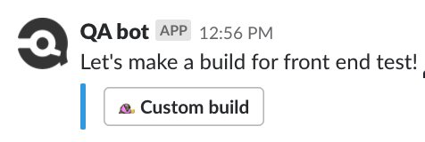
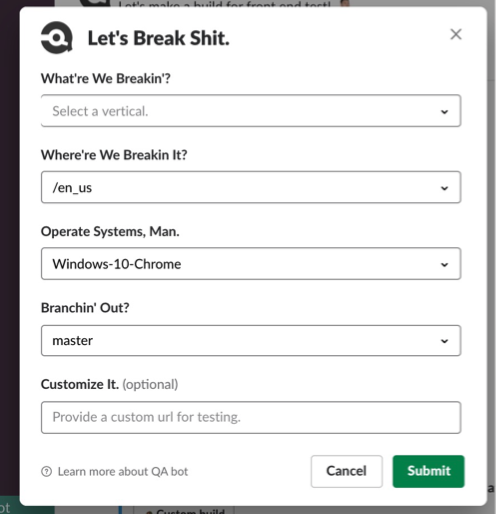

# circleci-slackbot
This service allows users to submit builds with custom parameters to circleci through [Slack](https://slack.com/), and view build information from CircleCI through API

---



* This is a python Flask service, meant to interact with Slack api and Circle CI. It could sit behind the ngrok tunnel or nginx(whatever), which provides webhook to receive and capture the requests from slack. The server could be deployed on cloud running 24/7 without hangup.
* Slack plugin uses cloud(like AWS instance) and allows for customisable commands on different git branches relating to each project. CircleBot can update with allure report build, github link etc.
* It is completely customisable, users can select suites options, platform options and a git branch of their desire, also user could expand options and dialog menus based on logic of bot.
* The bot is scalable, user could add more functions to interactive with slack buttons, redirect or call other apis like github, jira and so on.

**Set up**
User should firstly create app on [Slack apps](https://api.slack.com/apps), and generate auth token as `SLACK_BOT_TOKEN` from `https://api.slack.com/apps/:app_id/oauth?`. If User wants to add more button/slack command to interact with this flask app, channel_webhook could be get from `https://api.slack.com/apps/:app_id/incoming-webhooks?`

**Deploy**
Here is an example deploy to aws ec2 with ngrok tunnel, user also could set up devops with nginx, supervisord, ansible(deploy tokens) and so on.
1.AWS 
ssh -i circlecitest.pem ubuntu@xxx.compute-1.amazonaws.com to aws

2.source token environment
create secrets.sh to store token
```
export circleci_token=''
export SLACK_BOT_TOKEN=""
```
3.nohup run server
```
nohup python3 circleci_slack_api.py & ./ngrok http 5000 &
```
4.check ngrok server url and add it to slack circle bot
```
curl localhost:4040/api/tunnels
```
get ngrok server url, 
access to `https://api.slack.com/apps/:app_id/slash-commands?`
and `https://api.slack.com/apps/:app_id/interactive-messages?`
 configure circlebot apps request url
